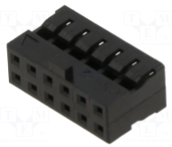
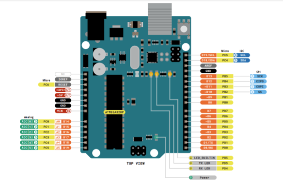
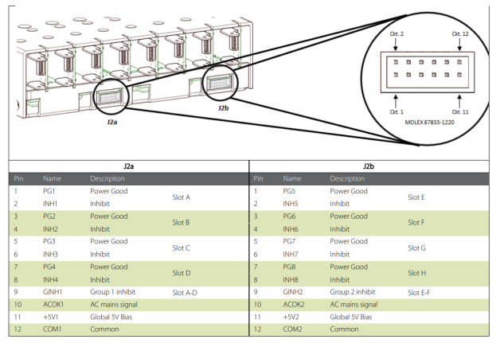

# pza-dev-voxpower-inhibiter


### `[VOX_INHIB_0000_00]` - Board used

The board used **must** be an Arduino UNO R3


### `[VOX_INHIB_0010_00]` - Cables

The connection between the PC and the Arduino **must** be via an USB 2.0 A to B

The connection between the Arduino and the Vox Power **must** be via simple cables linked to the connectors

### `[VOX_INHIB_0020_00]` - Connectors

The connectors for the Vox Power **must** be :

| Manufacturer | Housing   | Terminal  |
| :----------: | :-------: | :-------: |
| Molex        | 511101251 | 503948051 |



### `[VOX_INHIB_0030_00]` - Pinout

The inhibiter pinout **must** be :

| Arduino | D2   | D3   | D4   | D5   | D6   | D7   | D8   | D9   |
| :------ | :--: | :--: | :--: | :--: | :--: | :--: | :--: | :--: |
| Vox     | INH1 | INH2 | INH3 | INH4 | INH5 | INH6 | INH7 | INH8 |




### `[VOX_INHIB_0040_00]` - USB configuration

The USB configuration **must** be done with a serial link and a baud rate of 115200

### `[VOX_INHIB_0050_10]` - Communication protocol

The protocol to specify the action (inhibit or enable or state) and the channel N **must** be :
```bash
"I" N

"E" N

"S" N
```

When receiving a "S" the Arduino **must** return the state "HIGH" or "LOW" of the specified pin